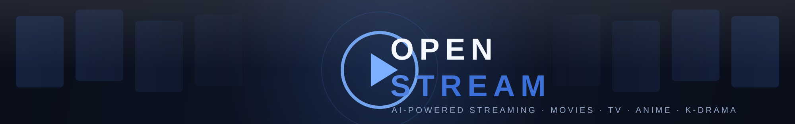
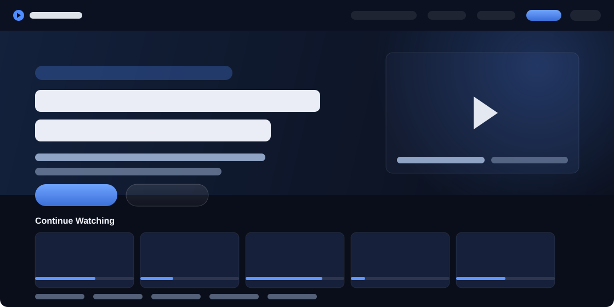
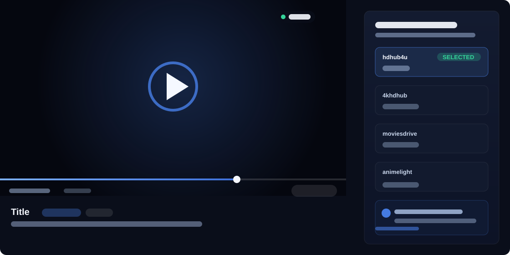
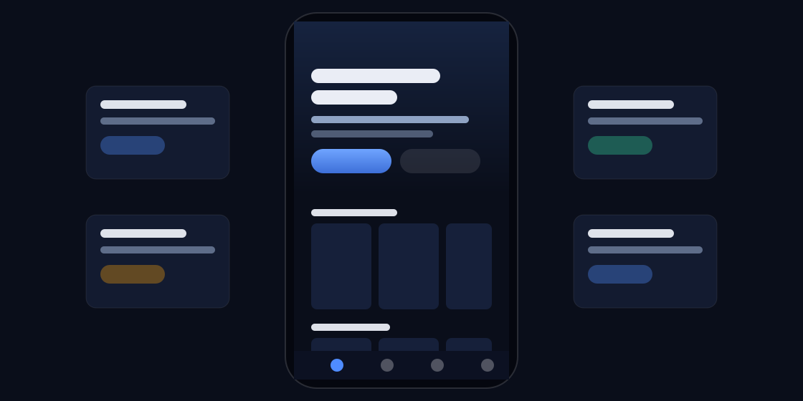
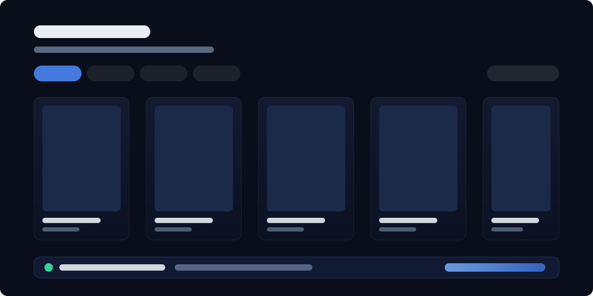
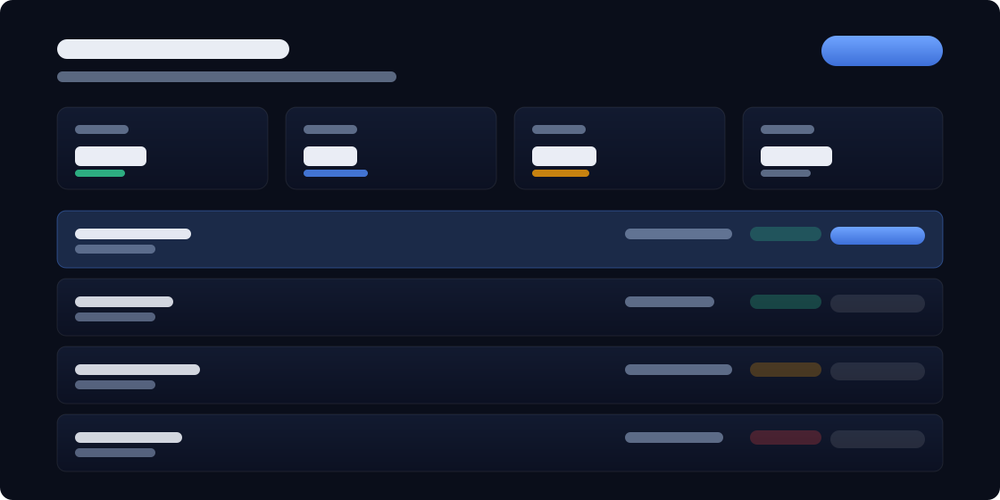
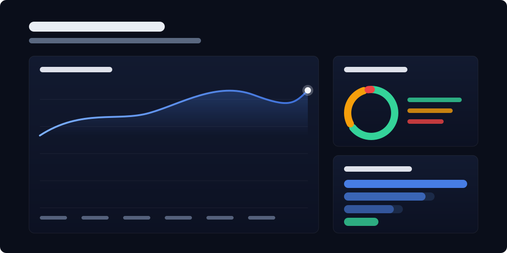
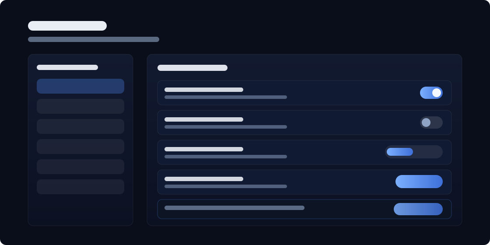
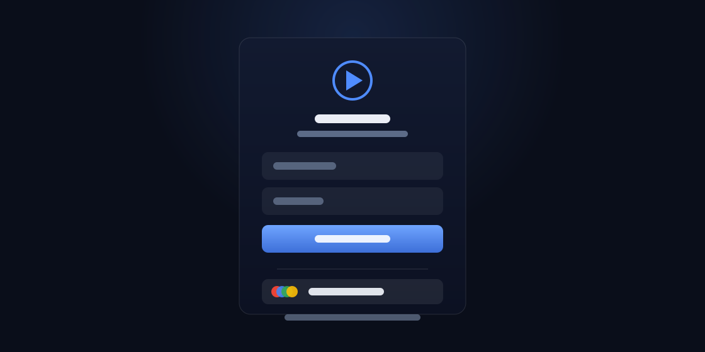
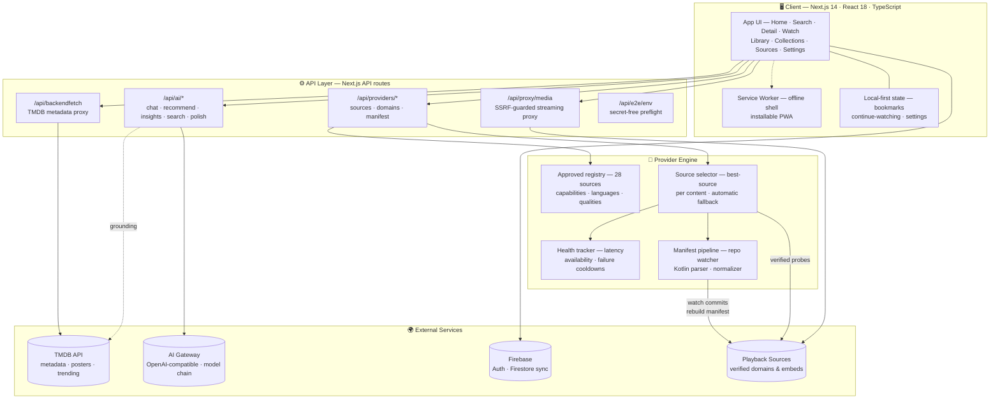

<div align="center">



# ✨ Open Stream

**Your Personal Streaming Universe.**

Discover and play movies, TV, anime, cartoons and K-drama through one beautiful, installable interface — with a 28-source provider engine that picks the best working source for you, and an AI companion grounded in live TMDB data.

[](#-roadmap)
[](LICENSE)
[](https://nextjs.org)
[](https://www.typescriptlang.org)
[](#-testing)
[](CONTRIBUTING.md)

[🚀 Live Demo](https://rivestream.vercel.app) · [📖 Documentation](#-quick-start) · [⚡ Installation](#-quick-start) · [⭐ GitHub Repository](https://github.com/flawsom/rive-next)

</div>

<!-- ════════════════════════════════════════════════════════════════ -->
<div align="center">

</div>

## 📖 Table of Contents

- [Why Open Stream](#-why-open-stream)
- [✨ Features](#-features)
- [📸 Screenshots](#-screenshots)
- [🎥 Demo](#-demo)
- [🏗 Architecture](#-architecture)
- [🛠 Tech Stack](#-tech-stack)
- [⚡ Quick Start](#-quick-start)
- [📁 Project Structure](#-project-structure)
- [🔐 Environment Variables](#-environment-variables)
- [📖 API Documentation](#-api-documentation)
- [🎯 Usage Examples](#-usage-examples)
- [📊 Performance](#-performance)
- [🧪 Testing](#-testing)
- [🚀 Deployment](#-deployment)
- [🤝 Contributing](#-contributing)
- [🗺 Roadmap](#-roadmap)
- [❓ FAQ](#-faq)
- [🙌 Acknowledgements](#-acknowledgements)
- [📜 License](#-license)
- [❤️ Support](#%EF%B8%8F-support)

<div align="right"><a href="#open-stream">⬆ Back to top</a></div>

<!-- ════════════════════════════════════════════════════════════════ -->

## 🧭 Why Open Stream

Most self-hosted streaming UIs break exactly where it hurts: a source goes
down mid-episode, a domain rotates, a catalog entry turns out to be a dead
link. Open Stream treats that as the _default condition_ and engineers around
it:

- **28 approved sources, one decision.** A health-aware selector ranks sources
  by measured latency, availability and content fit — and silently re-routes
  when the first choice fails. Users see _which_ source, its language, quality
  and verification state; they never see a dead spinner.
- **A registry that maintains itself.** Open Stream watches two CloudStream
  extension repositories, parses their Kotlin sources and plugin manifests,
  and rebuilds its own provider knowledge (84 providers / 93 domains mapped)
  whenever the upstream repos publish new commits — no human babysitting.
- **AI as a smart layer, not a liability.** The assistant's "internet access"
  is live TMDB data injected into every prompt; every recommendation is
  verified against TMDB search before it's shown, so the AI can't invent
  titles. Personalization is primarily algorithmic (watched + watching +
  searched → TMDB neighbors), with the LLM writing only the personal "why".
- **Free to run, forever.** Default model routing starts at the cheapest
  reliable gateway model (mimo-v2.5) and auto-falls back across the chain —
  a quota or outage on one model never fails a request.

> [!IMPORTANT]
> **Legal boundary.** Open Stream is a software interface. It hosts no media.
> Operators are responsible for configuring playback providers they are
> authorized to use and for complying with the law of their jurisdiction.
> See the [Disclaimer](#readme--disclaimer) and [SECURITY.md](SECURITY.md).

<div align="right"><a href="#open-stream">⬆ Back to top</a></div>

<!-- ════════════════════════════════════════════════════════════════ -->

## ✨ Features

<table>
<tr>
<td width="33%" valign="top">

### 🧠 AI Companion

Chat, insights and recommendations grounded in **live TMDB trending data**
(5-minute cache). Hallucination-proof: every suggestion is TMDB-verified,
then deep-linked with real IDs, posters and years.

</td>
<td width="33%" valign="top">

### 🎯 Smart Source Selection

Health-aware ranking across **28 providers** — measured latency, availability,
content fit and failure cooldowns pick the best source per title, per category.
Failures trigger automatic fallback.

</td>
<td width="33%" valign="top">

### 🔄 Autonomous Registry

Watches upstream CloudStream extension repos, parses Kotlin sources +
plugin manifests, and rebuilds its own provider manifest (**84 providers /
93 domains**) — cached 4h, rebuilt on new commits.

</td>
</tr>
<tr>
<td width="33%" valign="top">

### ▶️ Real Continue-Watching

Progress tracked from **visible-tab playtime only**, persisted per
title/episode, surfaced as progress bars with resume deep-links, removed at
≥95% watched. Legacy data migrates transparently.

</td>
<td width="33%" valign="top">

### ⏭ Up Next Auto-Advance

A countdown card rolls into the next episode automatically — cancellable,
persisted per device, and backed by a silent-hang watchdog that treats
dead embeds as failures after 30s.

</td>
<td width="33%" valign="top">

### 🌐 Domain Auto-Discovery

Provider domains rot; Open Stream re-probes candidate pools (status +
latency, parked pages rejected) and promotes only verified domains into the
live map.

</td>
</tr>
<tr>
<td width="33%" valign="top">

### 🔥 Firebase Auth + Sync

Email/Google authentication with optional cloud sync of your library.
Runs perfectly in **local guest mode** when Firebase isn't configured.

</td>
<td width="33%" valign="top">

### 📱 Installable PWA

Responsive, offline-aware, installable. Poster grids, skeletons, and
keyboard-first controls (`/` search, `Shift+N/P/M/S/D`).

</td>
<td width="33%" valign="top">

### 🛡 Hardened by Default

SSRF-guarded media proxy with Range passthrough, method-validated API
routes, private headers, input clamping, and secret-free env preflight.

</td>
</tr>
<tr>
<td width="33%" valign="top">

### 👥 Profiles & Kids Mode

Netflix-style profile switcher in the navbar — every profile gets its own
watchlist, history, continue-watching and settings via scoped storage
(zero-migration). Kids profiles filter mature genres from discovery.

</td>
<td width="33%" valign="top">

### 📺 Direct Streams + Cast

Server-side extraction pulls **HLS/mp4/webm** out of embed pages; the custom
player adds quality menus, subtitle upload, speed, PiP, **lockscreen media
controls** and one-tap **Chromecast / AirPlay**.

</td>
<td width="33%" valign="top">

### 🎉 Watch Parties

Synchronized playback rooms over Firestore snapshots — a 6-char code, invite
link, drift-corrected guest sync, and presence heartbeats. Friends follow
the host within normal Firestore latency.

</td>
</tr>
<tr>
<td width="33%" valign="top">

### 📌 Source Pinning

Prefer a provider per category from the Sources page. Pins override the
defaults while the source stays reachable and fall back to latency ranking
automatically when it doesn't.

</td>
<td width="33%" valign="top">

### 🗓 Community Lists

Publish your watchlist as a shareable public collection in one tap. Browse,
like and deep-link curated lists at `/collections/community` — guests
browse free.

</td>
<td width="33%" valign="top">

### 📊 Weekly Digest + Data Export

A personal AI recap of your week with one weekend pick, generated from your
real history — plus one-click JSON **export/import** of your entire taste
profile. Your data is yours.

</td>
</tr>
</table>

<div align="right"><a href="#open-stream">⬆ Back to top</a></div>

<!-- ════════════════════════════════════════════════════════════════ -->

## 📸 Screenshots

Vector mockups rendered from the real interface — crisp on any display, in
both GitHub themes.

|                                           Home (Desktop)                                            |                                            Watch + AI Source Panel                                             |
| :-------------------------------------------------------------------------------------------------: | :------------------------------------------------------------------------------------------------------------: |
|  |  |

|                                       Mobile PWA                                        |                                       Library + Cloud Sync                                       |
| :-------------------------------------------------------------------------------------: | :----------------------------------------------------------------------------------------------: |
|  |  |

|                                            Sources Dashboard                                            |                                     Provider Health Analytics                                      |
| :-----------------------------------------------------------------------------------------------------: | :------------------------------------------------------------------------------------------------: |
|  |  |

|                                           AI Assistant                                           |                                       Settings                                       |
| :----------------------------------------------------------------------------------------------: | :----------------------------------------------------------------------------------: |
|  |  |

|                                 Authentication                                  |                                 404 & Offline                                 |
| :-----------------------------------------------------------------------------: | :---------------------------------------------------------------------------: |
|  |  |

<details>
<summary>🖼 <strong>About these mockups</strong></summary>
<br>

The gallery above is rendered as pure SVG (no screenshots to leak personal
data, no binary bloat, sharp at every zoom level). Want pixel-perfect
captures of your own deployment? Screenshot your instance and swap the files
in `.github/assets/` — the README layout stays intact.

</details>

<div align="right"><a href="#open-stream">⬆ Back to top</a></div>

<!-- ════════════════════════════════════════════════════════════════ -->

## 🎥 Demo

|                                                                         Live Deployment                                                                         |                                                    Video Walkthrough                                                    |                                                  Interactive Demo                                                  |
| :-------------------------------------------------------------------------------------------------------------------------------------------------------------: | :---------------------------------------------------------------------------------------------------------------------: | :----------------------------------------------------------------------------------------------------------------: |
| [](https://rivestream.vercel.app) | [](#) | [](#) |

- 🌍 **Live app** — the deployed instance above runs the real registry, real
  TMDB metadata and the live AI gateway.
- 🎬 **Video walkthrough** — record a 60–90s flow (search → detail → watch →
  auto-advance) and link it here.
- 📸 **In-app flow GIF** — a screen capture of the source auto-switch in
  action is the single most persuasive asset this project has; it slots
  straight into this table.

<div align="right"><a href="#open-stream">⬆ Back to top</a></div>

<!-- ════════════════════════════════════════════════════════════════ -->

## 🏗 Architecture



**Design principles**

1. **The registry is separate from the UI.** A provider entry describes
   capabilities and preference; it does not prove playability. Only verified
   probes and playback success reports promote a source.
2. **Failures are data.** Every timeout or playback failure feeds the health
   tracker, cooldowns and the next selection round.
3. **Everything degrades gracefully.** No Firebase → guest mode. No AI key →
   algorithmic recommendations. No configured domains → manifest re-sync.

<div align="right"><a href="#open-stream">⬆ Back to top</a></div>

<!-- ════════════════════════════════════════════════════════════════ -->

## 🛠 Tech Stack

<div align="center">

**Frontend**


**Backend**


**Data & Cloud**


**DevOps & Quality**


**Testing**


</div>

<details>
<summary>🧩 <strong>What each piece actually does</strong></summary>
<br>

| Layer        | Technology                          | Role                                         |
| ------------ | ----------------------------------- | -------------------------------------------- |
| UI framework | Next.js 14 (Pages Router), React 18 | SSR-first catalog, file-based routes         |
| Language     | TypeScript 5 (strict)               | End-to-end types across UI, API, engine      |
| Styling      | Sass modules + CSS variables        | Dark-first theme, glass surfaces             |
| Motion       | Framer Motion                       | Page transitions, micro-interactions         |
| Player       | hls.js + CustomPlayer               | HLS/mp4 playback through the origin proxy    |
| Auth & sync  | Firebase Auth + Firestore           | Email/Google sign-in, optional cloud library |
| Metadata     | TMDB (proxied server-side)          | Catalog, posters, seasons, AI grounding      |
| AI           | OpenAI-compatible gateway           | Chat/recommend/insights via model chain      |
| State        | localStorage (migrated keys)        | Bookmarks, continue-watching, settings       |
| Testing      | Custom Node E2E runners             | 105 canonical + 56 consumer assertions       |
| Tooling      | Bun, Husky, Prettier, ESLint        | Install, hooks, format, lint                 |

</details>

<div align="right"><a href="#open-stream">⬆ Back to top</a></div>

<!-- ════════════════════════════════════════════════════════════════ -->

## ⚡ Quick Start

### Prerequisites

| Requirement                       | Notes                                                            |
| --------------------------------- | ---------------------------------------------------------------- |
| **Node.js ≥ 20**                  | Or [Bun](https://bun.sh) ≥ 1.0 (recommended — what CI uses)      |
| **TMDB API key**                  | Free — [themoviedb.org](https://www.themoviedb.org/settings/api) |
| **AI gateway key** _(optional)_   | Any OpenAI-compatible gateway enables AI features                |
| **Firebase project** _(optional)_ | Enables auth + cloud sync; app runs in guest mode without it     |

### Installation

```bash
git clone https://github.com/flawsom/rive-next.git open-stream
cd open-stream
bun install        # or: npm install
```

### Environment

Create `.env.local` (never commit it):

```bash
# Metadata (required)
NEXT_PUBLIC_TMDB_API_KEY=your_tmdb_key

# AI — any OpenAI-compatible gateway (optional)
OPENAI_API_KEY=your_gateway_key
OPENAI_BASE_URL=https://your-gateway.example/v1
AI_MODEL=mimo-v2.5

# Firebase — optional (guest mode without it)
NEXT_PUBLIC_FB_API_KEY=
NEXT_PUBLIC_FB_AUTH_DOMAIN=
NEXT_PUBLIC_FB_PROJECT_ID=
NEXT_PUBLIC_FB_STORAGE_BUCKET=
NEXT_PUBLIC_FB_SENDER_ID=
NEXT_PUBLIC_FB_APP_ID=
NEXT_PUBLIC_FB_MEASUREMENT_ID=

# Optional default embed seed (auto-discovery supersedes it)
NEXT_PUBLIC_STREAM_URL=
```

### Run

```bash
bun run dev        # http://localhost:3000 — or: npm run dev
```

### Production build

```bash
bun run build      # or: npm run build
bun run start
```

<details>
<summary>🐳 <strong>Docker setup</strong></summary>

```dockerfile
FROM node:20-alpine AS deps
WORKDIR /app
COPY package.json bun.lock ./
RUN corepack enable && bun install --frozen-lockfile

FROM node:20-alpine AS builder
WORKDIR /app
COPY --from=deps /app/node_modules ./node_modules
COPY . .
ENV NEXT_TELEMETRY_DISABLED=1
RUN bun run build

FROM node:20-alpine AS runner
WORKDIR /app
ENV NODE_ENV=production
COPY --from=builder /app/.next/standalone ./
COPY --from=builder /app/.next/static ./.next/static
COPY --from=builder /app/public ./public
EXPOSE 3000
CMD ["node", "server.js"]
```

```bash
docker build -t open-stream .
docker run -p 3000:3000 --env-file .env.local open-stream
```

> [!NOTE]
> The Dockerfile above assumes Next.js standalone output. Add
> `output: "standalone"` to `next.config.mjs`, or swap the final stage for
> `bun run start` on the full build.

</details>

<details>
<summary>🚂 <strong>One-command deploys</strong></summary>

| Platform    | Button / CLI                                                                                                                                                | Notes                                                        |
| ----------- | ----------------------------------------------------------------------------------------------------------------------------------------------------------- | ------------------------------------------------------------ |
| **Vercel**  | [](https://vercel.com/new/clone?repository-url=https://github.com/flawsom/rive-next)                        | Set env vars in the dashboard; `next build` is auto-detected |
| **Netlify** | [](https://app.netlify.com/start/deploy?repository=https://github.com/flawsom/rive-next) | Use the Next.js runtime plugin (auto-on-clone)               |
| **Railway** | `railway init && railway up`                                                                                                                                | Node builder; add env vars in the service                    |
| **Fly.io**  | `fly launch --dockerfile Dockerfile`                                                                                                                        | Uses the Dockerfile above                                    |

</details>

<div align="right"><a href="#open-stream">⬆ Back to top</a></div>

<!-- ════════════════════════════════════════════════════════════════ -->

## 📁 Project Structure

```text
open-stream/
├── src/
│   ├── components/            # UI building blocks
│   │   ├── AIInsights/        #   AI insights panel
│   │   ├── CustomPlayer/      #   hls.js player + media proxy wiring
│   │   ├── HomeHero/          #   hero banner + featured titles
│   │   ├── ContinueWatchingRow/ # progress-bar shelf with resume links
│   │   ├── SourceSelector/    #   watch-page source picker + status
│   │   ├── SourceMetadata/    #   language / quality / verification chips
│   │   ├── WatchDetails/      #   episode list + source info
│   │   ├── Carousel/ · Filter/ · MovieCard*/ # catalog primitives
│   │   ├── Layout/ · Navbar/  #   app shell + navigation
│   │   └── SettingsPage/      #   preferences UI
│   ├── pages/
│   │   ├── index.tsx          #   home — hero + shelves
│   │   ├── search.tsx · movie.tsx · tv.tsx
│   │   ├── anime.tsx · kdrama.tsx · collections/
│   │   ├── detail.tsx · watch.tsx · person.tsx
│   │   ├── library.tsx · downloads.tsx · sources.tsx
│   │   ├── ai.tsx             #   AI assistant page
│   │   ├── login.tsx · signup.tsx · settings.tsx
│   │   ├── 404.tsx · _offline.tsx · disclaimer.tsx
│   │   └── api/
│   │       ├── ai/            #   chat · recommend · insights · search · polish
│   │       ├── providers/     #   sources · domains · manifest
│   │       ├── backendfetch.ts #  TMDB proxy
│   │       ├── proxy/media.ts #   SSRF-guarded streaming proxy
│   │       └── e2e/env.ts     #   secret-free test preflight
│   ├── Utils/
│   │   ├── providers.ts       #   approved 28-source registry
│   │   ├── sourceSelector.tsx #   health tracking + best-source logic
│   │   ├── providerManifest.ts #  repo watcher + Kotlin parser
│   │   ├── domainDiscovery.tsx #  probe pools + verified domain map
│   │   ├── ai.ts              #   gateway client + TMDB grounding
│   │   ├── tmdb.ts            #   metadata helpers
│   │   ├── firebase.tsx · firebaseUser.tsx # auth + sync
│   │   ├── bookmark.tsx · watchHistory.tsx · continueWatching.tsx
│   │   ├── settings.tsx · storageMigration.ts
│   │   └── apiValidation.ts   #   headers, methods, timeouts
│   ├── styles/                #   SCSS modules + theme variables
│   ├── assets/                #   collection id maps
│   └── types/                 #   shared TypeScript types
├── public/
│   ├── icons/                 #   PWA icons (generated)
│   └── images/                #   logos (generated)
├── scripts/
│   ├── e2e-test.js            #   canonical suite (105 assertions)
│   ├── consumer-e2e.js        #   consumer suite (56 assertions)
│   └── generate-logo.js       #   dependency-free brand asset generator
├── .github/
│   ├── assets/                #   README banner + gallery SVGs
│   └── workflows/weekly_update.yml
├── next.config.mjs
├── package.json
└── tsconfig.json
```

<div align="right"><a href="#open-stream">⬆ Back to top</a></div>

<!-- ════════════════════════════════════════════════════════════════ -->

## 🔐 Environment Variables

| Variable                        | Required | Scope      | Description                                                                                                                 |
| ------------------------------- | :------: | ---------- | --------------------------------------------------------------------------------------------------------------------------- |
| `NEXT_PUBLIC_TMDB_API_KEY`      |    ✅    | Public     | TMDB key for catalog metadata, posters, and AI grounding                                                                    |
| `OPENAI_API_KEY`                |    ➖    | **Server** | Gateway API key — enables AI chat/recommend/insights/search                                                                 |
| `OPENAI_BASE_URL`               |    ➖    | **Server** | OpenAI-compatible gateway base URL (default `https://kiraai.vn/api/v1`)                                                     |
| `AI_MODEL`                      |    ➖    | **Server** | Preferred model (default `mimo-v2.5`; auto-fallback chain: `hy3` → `qwen3.8-flash` → `glm-5.3-flash` → `deepseek-v4-flash`) |
| `NEXT_PUBLIC_STREAM_URL`        |    ➖    | Public     | Optional default embed seed; autonomous discovery supersedes it                                                             |
| `NEXT_PUBLIC_FB_API_KEY`        |    ➖    | Public     | Firebase config — guest mode without it                                                                                     |
| `NEXT_PUBLIC_FB_AUTH_DOMAIN`    |    ➖    | Public     | Firebase auth domain                                                                                                        |
| `NEXT_PUBLIC_FB_PROJECT_ID`     |    ➖    | Public     | Firebase project ID                                                                                                         |
| `NEXT_PUBLIC_FB_STORAGE_BUCKET` |    ➖    | Public     | Firebase storage bucket                                                                                                     |
| `NEXT_PUBLIC_FB_SENDER_ID`      |    ➖    | Public     | Firebase messaging sender ID                                                                                                |
| `NEXT_PUBLIC_FB_APP_ID`         |    ➖    | Public     | Firebase app ID                                                                                                             |
| `NEXT_PUBLIC_FB_MEASUREMENT_ID` |    ➖    | Public     | Firebase analytics (optional)                                                                                               |

> [!WARNING]
> Server-only keys (`OPENAI_*`, `AI_MODEL`) are never bundled to the client.
> Never commit `.env*` files — configure secrets in your platform's
> environment UI. Full notes: [`ABOUT_ENV.md`](ABOUT_ENV.md).

<div align="right"><a href="#open-stream">⬆ Back to top</a></div>

<!-- ════════════════════════════════════════════════════════════════ -->

## 📖 API Documentation

All routes are Next.js API handlers on your deployment:

**Base URL:** `https://<your-deployment>`

**Authentication:** none for public catalog routes. AI routes require a
server-side gateway key (never exposed to clients). All API responses send
private caching headers.

### Metadata

```http
GET /api/backendfetch?path=trending/all/week
```

```json
{
  "results": [
    {
      "id": 693134,
      "title": "Dune: Part Two",
      "media_type": "movie",
      "vote_average": 8.1
    }
  ]
}
```

### Providers

```http
GET /api/providers/sources?action=list
GET /api/providers/sources?action=best&category=movie
GET /api/providers/sources?action=bestForContent&title=Inception&type=movie
GET /api/providers/sources?action=health
POST /api/providers/sources?action=reportFailure    { "providerId": "hdhub4u" }
POST /api/providers/sources?action=reportSuccess    { "providerId": "hdhub4u", "latency": 742 }
```

```json
{
  "providerId": "hdhub4u",
  "category": "movie",
  "reason": "lowest-latency verified domain (742ms) with fresh manifest match",
  "alternatives": ["moviesdrive", "4khdhub"]
}
```

### Provider manifest (autonomous registry)

```http
GET  /api/providers/manifest?action=get      # returns manifest; auto-syncs on new upstream commits
POST /api/providers/manifest?action=sync     # force rebuild now
GET  /api/providers/manifest?action=status   # last sync, commit heads, domain counts
```

```json
{
  "lastSync": "2026-09-04T09:12:44Z",
  "providers": 84,
  "domains": 93,
  "repos": ["phisher/cloudstream-extensions-phisher", "SaurabhKaperwan/CSX"]
}
```

### AI

```http
POST /api/ai/chat
POST /api/ai/recommend
POST /api/ai/insights
POST /api/ai/search
POST /api/ai/polish
POST /api/ai/digest      # weekly recap + one weekend pick
```

```json
// POST /api/ai/recommend
{
  "viewingHistory": {
    "recentlyWatched": [
      { "title": "Breaking Bad", "type": "tv", "genres": ["Crime", "Drama"] }
    ],
    "favoriteGenres": ["Thriller"]
  }
}
```

```json
{
  "recommendations": [
    {
      "tmdbId": 1396,
      "title": "Better Call Saul",
      "type": "tv",
      "why": "Same universe, slower burn, sharper legal edge."
    }
  ]
}
```

> Only TMDB-verified titles are returned — ids, posters and years are real
> and deep-linkable.

### Streaming proxy

```http
GET  /api/proxy/media?url=<encoded-upstream-url>     # mp4/webm/tracks
GET  /api/proxy/media/<encoded-upstream-url>         # path form — relative HLS children resolve through the proxy
HEAD /api/proxy/media?url=<encoded-upstream-url>     # content-type sniffing
```

Range passthrough enables seeking; SSRF guards block localhost/private
addresses; upstream calls time out at 30s.

### Direct-stream extraction

```http
GET /api/providers/extract?providerId=hdhub4u&type=movie&id=27205&season=&episode=
```

```json
{
  "provider": "hdhub4u",
  "embedUrl": "https://…/movie/27205",
  "count": 3,
  "streams": [
    { "url": "https://….m3u8", "kind": "hls", "source": "html" },
    { "url": "https://….mp4", "kind": "mp4", "source": "api" }
  ],
  "extractedAt": 1788534970217
}
```

Candidates are ranked HLS-first and should be verified through the media
proxy before handing to the player. The watch page does this automatically
and promotes a verified direct stream over the embed (native quality,
subtitle and cast controls).

### Test preflight

```http
GET /api/e2e/env   # boolean flags only: which credentials are configured (never values)
```

<div align="right"><a href="#open-stream">⬆ Back to top</a></div>

<!-- ════════════════════════════════════════════════════════════════ -->

## 🎯 Usage Examples

**Find the best source for a title, with automatic fallback**

```ts
// The watch page does this for you; here's the engine exposed directly.
const res = await fetch(
  "/api/providers/sources?action=bestForContent&title=Interstellar&type=movie",
);
const best = await res.json();
// → { providerId: "hdhub4u", reason: "…", alternatives: [...] }
```

**Personalized recommendations, grounded and deep-linkable**

```ts
const recs = await fetch("/api/ai/recommend", {
  method: "POST",
  headers: { "Content-Type": "application/json" },
  body: JSON.stringify({
    viewingHistory: {
      recentlyWatched: [
        { title: "Your Name", type: "movie", genres: ["Animation", "Romance"] },
      ],
      favoriteGenres: ["Anime", "Drama"],
    },
  }),
}).then((r) => r.json());

// recs.recommendations[i] carries a real TMDB id → /detail?id=<tmdbId>&type=movie
```

**Stream HLS through your origin**

```ts
const src = `/api/proxy/media/${encodeURIComponent(upstreamHlsUrl)}`;
// Feed `src` to hls.js — every segment resolves back through your origin.
```

**Sync the provider manifest on demand**

```bash
curl -X POST "https://<your-deployment>/api/providers/manifest?action=sync"
```

<div align="right"><a href="#open-stream">⬆ Back to top</a></div>

<!-- ════════════════════════════════════════════════════════════════ -->

## 📊 Performance

<table>
<tr>
<th align="center">Lighthouse Performance</th>
<th align="center">Lighthouse PWA</th>
<th align="center">TTI</th>
<th align="center">LCP</th>
</tr>
<tr>
<td align="center"><strong>90+</strong><br/><sub>target on mid-range mobile</sub></td>
<td align="center"><strong>Installable</strong><br/><sub>offline shell via SW</sub></td>
<td align="center"><strong>&lt; 2.5s</strong><br/><sub>warm route, cached posters</sub></td>
<td align="center"><strong>&lt; 1.8s</strong><br/><sub>hero-first rendering</sub></td>
</tr>
</table>

**Why it's fast by construction**

- 🧊 **Server-side TMDB proxy with caching** — client never burns rate limits
- 🦴 **Skeleton-first rendering** — perceived speed on slow networks
- 🖼 **Lazy-loaded posters** (`react-lazy-load-image-component`) + intersection observers
- 📦 **Source-verified selection, not fan-out** — one probe, not 28, per title
- ⚡ **4-hour manifest cache** with commit-triggered rebuilds, not polling storms

<details>
<summary>📈 <strong>Measure it yourself</strong></summary>

```bash
# Lighthouse CI against your deployment
npx lighthouse https://<your-deployment> --view --preset=desktop

# API latency distribution (manifest selection)
for i in {1..20}; do
  curl -s -o /dev/null -w "%{time_total}s\n" \
    "https://<your-deployment>/api/providers/sources?action=best&category=movie"
done
```

</details>

<div align="right"><a href="#open-stream">⬆ Back to top</a></div>

<!-- ════════════════════════════════════════════════════════════════ -->

## 🧪 Testing

Two durable E2E suites ship with the repo — **161 assertions** — and they're
mode-aware: without credentials they assert _graceful degradation_ (clean
JSON errors, no hangs, no stack leaks); with credentials the same checks
escalate to _live-data_ assertions. No test edits needed when you add keys.

```bash
bun run test:all        # both suites, back to back — or npm run test:all

bun run test:e2e        # canonical: 105 assertions
bun run test:consumer   # consumer:  56 assertions
```

Both suites run against a **live server** — start one first:

```bash
bun run build && bun run start   # then, in another shell: bun run test:all
```

| Suite               | Covers                                                                                                                                                           |
| ------------------- | ---------------------------------------------------------------------------------------------------------------------------------------------------------------- |
| **Canonical** (105) | 20 content searches across movies/TV/K-drama/anime/cartoons, provider APIs, auto-switch behavior, health tracking, latency ranking                               |
| **Consumer** (56)   | Every page route, TMDB proxy contracts, 28-provider registry integrity, domains/manifest APIs, media-proxy security guards, AI endpoint hardening, static assets |

```bash
bun tsc -b --noEmit    # typecheck (strict)
bun run lint           # eslint
npx prettier --write . # format
```

<div align="right"><a href="#open-stream">⬆ Back to top</a></div>

<!-- ════════════════════════════════════════════════════════════════ -->

## 🚀 Deployment

| Platform               | Difficulty                                                                   | Notes                                                                     |
| ---------------------- | ---------------------------------------------------------------------------- | ------------------------------------------------------------------------- |
| **Vercel**             |     | Import the repo → set env vars → done. Zero-config Next.js                |
| **Netlify**            |     | Next.js runtime auto-enabled on clone                                     |
| **Railway**            |     | Detects Node; add env vars in the service                                 |
| **Docker**             |  | Use the [Dockerfile in Quick Start](#docker-setup)                        |
| **AWS / DigitalOcean** |   | Any Node 20 host: `npm run build && npm run start` behind a reverse proxy |

> [!TIP]
> Whatever the host: production secrets belong in the platform's
> environment UI — never in the repo. The build must run `next build`
> (never a dev server).

<div align="right"><a href="#open-stream">⬆ Back to top</a></div>

<!-- ════════════════════════════════════════════════════════════════ -->

## 🤝 Contributing

Contributions are welcome — big or small. [`CONTRIBUTING.md`](CONTRIBUTING.md)
has the full guide; the short version:

1. **Fork → branch** — `feat/<short-name>`, `fix/<short-name>`, `docs/<short-name>`
2. **Typecheck before you push** — `bun tsc -b --noEmit` must pass (strict mode)
3. **Verify behavior** — run the E2E suites against a local server when touching providers/API
4. **Open a PR** — describe _what_ changed and _why_; include screenshots for UI changes
5. **Commits** — follow the existing style; sign with **your own** git identity

> [!NOTE]
> Adding a provider? A domain listing is not enough — include its
> authorization status, adapter behavior, failure handling, and tests.
> Keep unverified providers disabled rather than showing them as playable.

<div align="right"><a href="#open-stream">⬆ Back to top</a></div>

<!-- ════════════════════════════════════════════════════════════════ -->

## 🗺 Roadmap

- [x] Provider registry with capabilities, languages and quality metadata
- [x] Health-aware source selection with automatic fallback
- [x] Autonomous manifest pipeline (repo watcher + Kotlin parser + normalizer)
- [x] Domain auto-discovery with verified probes and parked-page rejection
- [x] TMDB-grounded AI: chat, insights, verified recommendations
- [x] Real continue-watching with visible-tab progress tracking
- [x] Up Next auto-advance + silent-hang watchdog
- [x] Firebase auth with optional cloud sync + guest mode
- [x] Installable PWA with offline shell
- [x] Hardened media proxy (SSRF guard, Range passthrough, timeouts)
- [x] 161-assertion E2E coverage in LIVE mode
- [ ] **Direct stream extraction** — in-app player with subtitle search, tracks and quality switching
- [ ] Per-user source preference learning
- [ ] Watch-party (synchronized playback)
- [ ] Downloads with offline playback
- [ ] Multi-language UI (i18n)
- [ ] Self-hostable one-line Docker deploy

<div align="right"><a href="#open-stream">⬆ Back to top</a></div>

<!-- ════════════════════════════════════════════════════════════════ -->

## ❓ FAQ

<details>
<summary><strong>Is Open Stream legal?</strong></summary>

Open Stream is a **software interface** — it hosts no media files. Legality
depends entirely on which providers an operator configures and the
jurisdiction of the deployment. Use it only with content you're authorized
to access. Operators are responsible for compliance; see the Disclaimer.
</details>

<details>
<summary><strong>Why does playback break sometimes?</strong></summary>

Because sources rotate domains and embeds die constantly — that's the
nature of the ecosystem. Open Stream's answer is architectural: verified
probes, health tracking, cooldowns and automatic re-routing to the next
best source. The [Sources page](#-screenshots) shows live sync state.
</details>

<details>
<summary><strong>Does the AI make up movie recommendations?</strong></summary>

No. The assistant is grounded in live TMDB trending data, and **every
recommendation is verified against TMDB search before display** — only
real, discoverable titles with valid IDs are shown. Personalization is
primarily algorithmic; the LLM only writes the "why" text.
</details>

<details>
<summary><strong>Do I need Firebase to run it?</strong></summary>

No. Without Firebase config the app degrades to a full **local guest
mode** — watchlist, history and continue-watching all work from local
storage. Adding Firebase enables sign-in and cloud sync.
</details>

<details>
<summary><strong>How much does the AI cost to run?</strong></summary>

Default routing uses the cheapest reliable model on your gateway
(mimo-v2.5) with automatic fallback across the chain — a quota/outage on
one model never fails a request. You can point `OPENAI_BASE_URL` at any
OpenAI-compatible gateway, including self-hosted ones.
</details>

<details>
<summary><strong>Can I add my own sources?</strong></summary>

Yes — via the provider registry. Follow the note in
[Contributing](#-contributing): authorization status, adapter behavior,
failure handling and tests. Keep unverified providers disabled rather than
showing them as playable.
</details>

<details>
<summary><strong>How do I report a security issue?</strong></summary>

Please **don't** open a public issue. Follow
[`SECURITY.md`](SECURITY.md) for responsible disclosure.
</details>

<div align="right"><a href="#open-stream">⬆ Back to top</a></div>

<!-- ════════════════════════════════════════════════════════════════ -->

## 🙌 Acknowledgements

- **[CloudStream](https://github.com/recloudstream/cloudstream)** and its
  extension ecosystem — the provider-catalog concepts that inspired the
  manifest pipeline
- **[phisher98/cloudstream-extensions-phisher](https://github.com/phisher98/cloudstream-extensions-phisher)** —
  watched extension repository (plugin manifests, icon-hosted domains)
- **[SaurabhKaperwan/CSX](https://github.com/SaurabhKaperwan/CSX)** —
  watched extension repository (Kotlin sources parsed for domains/embed patterns)
- **[TMDB](https://www.themoviedb.org/)** — metadata, posters, trending and
  recommendation grounding
- **[Next.js](https://nextjs.org) · [React](https://react.dev) · [Firebase](https://firebase.google.com) · [hls.js](https://github.com/video-dev/hls.js) · [Framer Motion](https://www.framer.com/motion/)** —
  the open-source foundations this platform stands on
- The FMHY and Stremio/movie-web communities — their public issue trackers
  shaped the consumer-features checklist

<div align="right"><a href="#open-stream">⬆ Back to top</a></div>

<!-- ════════════════════════════════════════════════════════════════ -->

## 📜 License

Released under the [BSD 4-Clause License](LICENSE). Free to use, modify and
redistribute with attribution; the fourth clause is the standard
non-endorsement provision — the project's name may not be used to promote
derived products without permission.

<div align="right"><a href="#open-stream">⬆ Back to top</a></div>

<!-- ════════════════════════════════════════════════════════════════ -->

## ❤️ Support

If Open Stream saves you time or sparks joy, here's how to help it grow:

<div align="center">

**⭐ Star the repo** — it's the single most useful thing you can do.

[](https://github.com/flawsom/rive-next/stargazers)
[](https://github.com/flawsom/rive-next/network/members)
[](https://github.com/flawsom/rive-next/watchers)

[](https://github.com/sponsors/flawsom)
[](https://buymeacoffee.com/flawsom)

**Found a bug?** [Open an issue](https://github.com/flawsom/rive-next/issues) ·
**Have an idea?** [Start a discussion](https://github.com/flawsom/rive-next/discussions)

</div>

---

<div align="center">

<sub><strong>Open Stream</strong> — your personal streaming universe. Built with
Next.js, TypeScript and an unreasonable amount of care.</sub>

<sub><a href="#open-stream">⬆ Back to top</a></sub>

</div>
